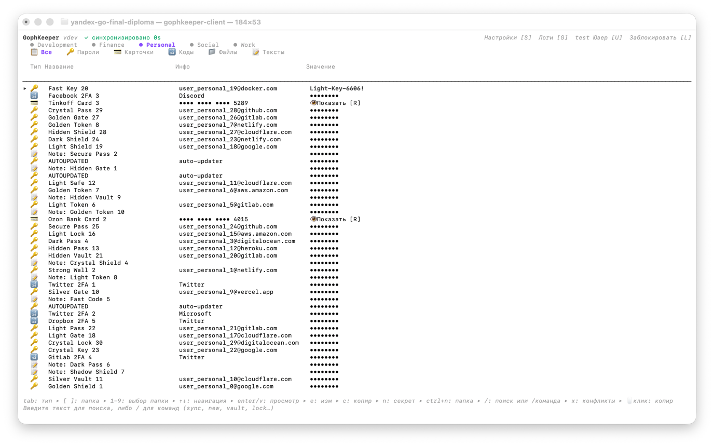

# GophKeeper

Клиент-серверный менеджер паролей: надёжное хранение логинов/паролей, банковских карт, текстовых заметок, TOTP-кодов и произвольных файлов с end-to-end шифрованием на стороне клиента и синхронизацией между устройствами.



## Содержание

- [Возможности](#возможности)
- [Соответствие требованиям задания](#соответствие-требованиям-задания)
- [Архитектура](#архитектура)
- [Graceful shutdown](#graceful-shutdown)
- [Модель безопасности](#модель-безопасности)
- [Быстрый старт](#быстрый-старт)
- [Клиент: TUI](#клиент-tui)
- [Клиент: CLI](#клиент-cli)
- [Разработка](#разработка)
- [Тестирование](#тестирование)

## Возможности

- Пять типов секретов: логин/пароль, банковская карта, текстовая заметка, TOTP-коды, произвольные файлы (через MinIO, потоково).
- Два клиентских интерфейса на одной кодовой базе: полноэкранный TUI (Bubble Tea) и классический one-shot CLI.
- Офлайн-режим: локальный кеш (SQLite), отложенная очередь изменений (outbox), автоматическое проигрывание при восстановлении сети.
- Оптимистичная блокировка по версии секрета с явным разрешением конфликтов (моя версия / серверная).
- Recovery codes для восстановления мастер-ключа при потере мастер-пароля.
- Многоустройственная синхронизация с выбором, какие папки (vault) синхронизировать.
- Локализация интерфейса (en/ru).

## Соответствие требованиям задания

Полный текст технического задания: [`docs/tz.md`](docs/tz.md).

**Обязательные требования:**

- [x] Регистрация, аутентификация и авторизация пользователей (JWT, gRPC)
- [x] Надёжное хранение приватных данных (AEAD-шифрование на клиенте, сервер хранит только шифротексты)
- [x] Синхронизация данных между несколькими клиентами одного владельца
- [x] Передача приватных данных владельцу по запросу
- [x] Хранение произвольной текстовой метаинформации к любому типу данных (тэги, заметки, доп. поля)
- [x] Распространение клиента в виде CLI-приложения, кросс-платформенная сборка (Windows/Linux/macOS — чистый Go, `modernc.org/sqlite` без cgo)
- [x] Получение версии и даты сборки клиента (`gophkeeper-client version`)
- [x] Покрытие тестами ≥70% (порог зафиксирован в `.testcoverage.yml`, проверяется в CI)
- [x] Документация экспортируемых функций/типов/пакетов (godoc-комментарии)
- [x] Штатное завершение по `SIGTERM`/`SIGINT`/`SIGQUIT` с сохранением данных «в полёте»

**Типы хранимой информации:**

- [x] Логин/пароль
- [x] Произвольные текстовые данные
- [x] Произвольные бинарные данные (потоковая загрузка через MinIO)
- [x] Банковские карты

**Необязательные функции:**

- [x] Поддержка OTP (one-time password): TOTP-коды как отдельный тип секрета + одноразовые recovery-коды внутри любого секрета
- [x] Терминальный интерфейс (TUI, Bubble Tea)
- [x] Бинарный протокол — gRPC/protobuf
- [x] Функциональные и интеграционные тесты (testcontainers для Postgres/MinIO)
- [ ] Описание протокола в формате Swagger — не реализовано (протокол описан в `api/proto/gophkeeper/v1/gophkeeper.proto`, gRPC вместо REST/Swagger)

## Архитектура

```
cmd/
  client/     — точка входа клиента (TUI по умолчанию, CLI — при наличии аргументов)
  server/     — точка входа gRPC-сервера

internal/client/
  app/        — DI-контейнер, сборка usecase-слоя
  cli/        — команды CLI (kong)
  tui/        — экраны Bubble Tea (dashboard, формы, конфликты, lock/unlock)
  usecase/    — бизнес-логика (auth, vault, secret, sync)
  contracts/  — интерфейсы (ServerClient, LocalStorage, Cipher, ...) + моки
  localstore/ — SQLite-кеш + очередь outbox
  grpcclient/ — gRPC-клиент к серверу
  cryptoimpl/ — AEAD-шифрование, обёртка ключей
  session/    — состояние текущей сессии (MasterKey, VaultKey, PIN)
  keyring/    — хранение токенов (системный keychain / файл-fallback / только в памяти при --no-persist)
  i18n/       — локализация (en/ru, TOML)

internal/server/
  app/            — bootstrap сервера
  usecase/        — бизнес-логика (auth, vault, secret, blob)
  transport/      — gRPC-хендлеры
  infra/postgres/ — sqlc-запросы, миграции
  infra/objectstore/ — интеграция с MinIO

api/proto/    — protobuf-схема (buf)
deployments/  — Dockerfile сервера, docker-compose (postgres + minio + server)
```

Протокол клиент-сервер — gRPC (см. `api/proto/gophkeeper/v1/gophkeeper.proto`).

## Graceful shutdown

И клиент, и сервер штатно завершаются по `SIGTERM`, `SIGINT`, `SIGQUIT` — данные, находившиеся в обработке в момент сигнала, успевают сохраниться до выхода процесса.

**Сервер** (`internal/server/app/lifecycle.go`, `Container.Run`): `signal.NotifyContext(ctx, syscall.SIGINT, syscall.SIGTERM, syscall.SIGQUIT)` перехватывает все три сигнала. По срабатыванию:
1. `c.GRPC.Stop()` → `grpcServer.GracefulStop()` — сервер перестаёт принимать НОВЫЕ соединения, но дожидается завершения уже начатых RPC (в том числе тех, что сейчас пишут в Postgres/MinIO), с таймаутом `shutdownTimeout = 10s`.
2. pprof HTTP-сервер (если включён) останавливается через `Shutdown(ctx)`.
3. Пул соединений с БД закрывается последним, когда все RPC уже завершены.

**Клиент CLI** (`cmd/client/main.go`, non-TUI ветка `main()`): CLI-команды — одноразовые и короткие (kong вызывает ровно один `Run()` и завершает процесс). Без явной обработки `SIGINT/SIGTERM/SIGQUIT` runtime Go убивает процесс НЕМЕДЛЕННО (default disposition ОС) — если сигнал приходит посреди сетевого вызова (например `CreateSecret`), запрос прерывается на середине. `signal.Ignore(syscall.SIGINT, syscall.SIGTERM, syscall.SIGQUIT)` отключает это мгновенное убийство: текущая команда спокойно дописывает свой RPC и завершается штатным `return` из `kctx.Run()`, доходя до `defer container.Close()`. Дополнительная защита данных: outbox-запись (locally durable) всегда пишется в SQLite синхронно ДО сетевого вызова (см. `internal/client/usecase/sync/outbox_replay.go`), поэтому даже жёсткое `SIGKILL` (который нельзя перехватить) не теряет операцию — она просто переиграется при следующем `sync`.

**Клиент TUI** (`cmd/client/main.go`, `runTUI()`): TUI — long-running процесс, поэтому здесь настоящий graceful shutdown, а не просто игнорирование сигнала. `signal.NotifyContext` в отдельной горутине по сигналу вызывает `p.Quit()` (bubbletea отрисовывает последний кадр и возвращает управление из `p.Run()`), после чего перед `container.Close()` явно вызывается `container.Sync.ReplayOutbox(ctx)` с таймаутом `shutdownFlushTimeout = 5s` — тот же путь, что и фоновый sync в dashboard, дожимающий несохранённые локальные изменения на сервер.

Проверено тестом с РЕАЛЬНЫМ сигналом (не имитацией): `internal/server/app/app_smoke_test.go` поднимает полный стек (Postgres через testcontainers + gRPC), делает живой `Register`, затем шлёт себе настоящий `syscall.Kill(os.Getpid(), syscall.SIGQUIT)` и проверяет, что `Container.Run()` завершается без ошибки в течение 15 секунд.

## Модель безопасности

- **MasterKey** — случайный 32-байтный ключ, генерируется при первичной настройке шифрования. Хранится на сервере только в обёрнутом виде (`enc_master_key`), обёртка снимается локально на клиенте.
- **KEK (key-encryption-key)** выводится из мастер-пароля через Argon2id + HKDF. Именно KEK оборачивает MasterKey — при смене пароля переоборачивается только KEK, сам MasterKey и все `wrapped_vault_key` остаются валидными.
- **VaultKey** — отдельный ключ на каждую папку (vault), обёрнут MasterKey.
- Каждый секрет разбит на три тира с независимым AEAD-шифрованием и AAD, включающим `vault_id|secret_id|version|tier`:
    - **Tier 2a (row)** — заголовочные поля для списка (заголовок, тэги, юзернейм/URI).
    - **Tier 2b (index)** — поля для поиска (заметки, доп. поля), догружаются асинхронно.
    - **Tier 3 (payload)** — чувствительные данные (пароль, PAN/CVV, тело TOTP-секрета).
- **Recovery codes** — 5 одноразовых кодов, каждый шифрует копию MasterKey отдельным ключом (HKDF от кода). Позволяют восстановить MasterKey без мастер-пароля; после восстановления клиент требует задать новый пароль.
- Сервер никогда не видит plaintext секретов, MasterKey, VaultKey или мастер-пароль — только шифротексты и непрозрачные KDF-параметры.

## Быстрый старт

### Требования

- Go 1.26+
- Docker и docker-compose (для сервера: Postgres + MinIO)
- [Taskfile](https://taskfile.dev) (опционально, упаковывает основные команды)

### Поднять сервер

```bash
task docker-up
# или напрямую:
cd deployments && docker compose up --build -d
```

Сервер слушает `:9090` (gRPC), Postgres — `:5433`, консоль MinIO — `:9001`.

### Собрать клиент

```bash
task build-client
# или напрямую:
go build -o bin/gophkeeper-client ./cmd/client
```

### Запустить

```bash
# TUI (по умолчанию, без аргументов)
./bin/gophkeeper-client

# CLI
./bin/gophkeeper-client register alice
./bin/gophkeeper-client secret list <vault>
```

При первом запуске без аргументов TUI покажет onboarding (адрес сервера, каталог данных). Эти настройки также можно передать через флаги/переменные окружения/`config.json` — тот же механизм, что у CLI.

```bash
./bin/gophkeeper-client -s localhost:9090   # адрес сервера через флаг
DATA_DIR=/tmp/my-device ./bin/gophkeeper-client  # отдельный каталог данных (для эмуляции второго устройства)
```

## Клиент: TUI

Полноэкранный интерфейс на Bubble Tea. Основной экран — dashboard: верхняя строка (статус синхронизации, настройки, логи, юзер), вкладки папок, вкладки типов секретов, таблица, нижняя командная/поисковая строка.

Горячие клавиши (см. подсказку в нижней строке экрана):

| Клавиша | Действие |
|---|---|
| `tab` / `shift+tab` | переключить тип секрета |
| `[` / `]` | переключить папку (vault) |
| `1`-`9` | быстрый выбор папки |
| `↑↓` | навигация по таблице |
| `enter` | открыть секрет на редактирование |
| `v` | просмотр секрета (read-only) |
| `c` | скопировать значение в буфер |
| `n` | создать секрет в текущей папке |
| `ctrl+n` | создать новую папку |
| `/` | живой поиск по таблице |
| `:` | командная строка (`:sync`, `:new`, `:lock`, `:logs`, `:conflicts`, `:quit`) |
| `x` | открыть нерешённые конфликты синхронизации |
| `s` | настройки |
| `g` | логи клиента |
| `u` | меню пользователя |
| `l` | заблокировать сессию |

## Клиент: CLI

One-shot команды (каждый вызов — новый процесс без сохранённой сессии между вызовами; токены/KDF-параметры кешируются локально).

```bash
# Аккаунт и шифрование
gophkeeper-client register [login]
gophkeeper-client login [login]
gophkeeper-client setup-encryption
gophkeeper-client recover [code]        # восстановление мастер-ключа по recovery-коду

# Папки
gophkeeper-client vault create <name>
gophkeeper-client vault list

# Секреты (login/password)
gophkeeper-client secret add <vault>
gophkeeper-client secret list <vault> [--refresh]
gophkeeper-client secret search <vault> <query>
gophkeeper-client secret get <vault> <id>       # показать пароль
gophkeeper-client secret show <vault> <id>      # полная карточка
gophkeeper-client secret update <vault> <id>
gophkeeper-client secret delete <vault> <id>

# Прочие типы секретов
gophkeeper-client secret text add|list|show|update <vault> [<id>]
gophkeeper-client secret card add|list|show|update <vault> [<id>]
gophkeeper-client secret totp add|list|code|update <vault> [<id>]
gophkeeper-client secret file add|list|download <vault> [<path>|<id>]

# OTP-коды восстановления внутри секрета
gophkeeper-client secret otp-use <vault> <id> <index>

# Синхронизация и офлайн-очередь
gophkeeper-client sync
gophkeeper-client outbox list
gophkeeper-client outbox resolve <id>   # разрешить конфликт синхронизации (mine/server)

# Прочее
gophkeeper-client logs [--lines N] [--clear]
gophkeeper-client ping
gophkeeper-client version
```

Полный список — `gophkeeper-client --help` или `gophkeeper-client <команда> --help`.

## Разработка

Все основные операции обёрнуты в `Taskfile.yaml`:

```bash
task generate       # regen proto + sqlc + mocks
task build           # собрать сервер и клиент
task lint            # golangci-lint
task coverage        # тесты с покрытием + порог из .testcoverage.yml
task docker-reset     # полный сброс окружения (БД + MinIO)
```

Кодогенерация:

- `api/proto/` → Go-код через `buf` (`task proto-generate`)
- SQL-запросы (`internal/server/infra/postgres/queries`) → через `sqlc` (`task sqlc-generate`)
- Моки интерфейсов (`.mockery.yaml`) → через `mockery` (`task mocks-generate`)

## Профилирование (pprof)

Сервер и клиент (только TUI-режим) умеют поднимать отдельный HTTP-listener с `net/http/pprof` —
по умолчанию выключен, включается явно через конфиг:

```bash
# Сервер
PPROF_ADDRESS=0.0.0.0:6061 ./bin/gophkeeper-server
# или в config.json / docker-compose.yml: "pprof_address": "0.0.0.0:6061"

# Клиент (TUI)
PPROF_ADDRESS=127.0.0.1:6062 ./bin/gophkeeper-client
```

```bash
go tool pprof http://localhost:6061/debug/pprof/profile?seconds=30   # CPU-профиль сервера
go tool pprof http://localhost:6061/debug/pprof/heap                 # снимок кучи
```

pprof-эндпоинты отдают стек-трейсы и содержимое кучи процесса — не открывайте порт наружу без сетевой изоляции (VPN/firewall), даже в тестовом окружении.

### Бенчмарки

Горячие пути usecase-слоя сервера покрыты `go test -bench` (без сети/БД — на моках, изолированно от инфраструктуры):

```bash
go test ./internal/server/usecase/secret/... -bench=. -benchmem -run=^$
go test ./internal/server/usecase/auth/... -bench=. -benchmem -run=^$

# С профилем CPU для конкретного бенчмарка:
go test ./internal/server/usecase/auth/... -bench=BenchmarkRegister -cpuprofile=cpu.out -run=^$
go tool pprof cpu.out
```

Фактический вывод (Apple M3 Pro, `GOMAXPROCS=11`, после фикса Argon2id-параметров — см. "Находка 1" ниже):

```
$ go test ./internal/server/usecase/auth/... -bench=. -benchmem -run=^$
goos: darwin
goarch: arm64
pkg: github.com/aikowocki/yandex-go-final-diploma/internal/server/usecase/auth
cpu: Apple M3 Pro
BenchmarkRegister-11             55  21279555 ns/op  19947795 B/op  100 allocs/op
BenchmarkRegister_Parallel-11   301   4227044 ns/op  19952155 B/op  115 allocs/op
BenchmarkLogin_Success-11        54  20471316 ns/op  20313891 B/op  105 allocs/op
PASS
ok   github.com/aikowocki/yandex-go-final-diploma/internal/server/usecase/auth  6.482s

$ go test ./internal/server/usecase/secret/... -bench=. -benchmem -run=^$
goos: darwin
goarch: arm64
pkg: github.com/aikowocki/yandex-go-final-diploma/internal/server/usecase/secret
cpu: Apple M3 Pro
BenchmarkCreateSecret_Success-11                     44637   24273 ns/op  16224 B/op  173 allocs/op
BenchmarkUpdateSecret_Success-11                     48939   24622 ns/op  16523 B/op  166 allocs/op
BenchmarkUpdateSecret_Conflict-11                   154610    7655 ns/op   5606 B/op   55 allocs/op
BenchmarkListRow_ManySecrets/10_secrets-11          174408    6854 ns/op   5473 B/op   53 allocs/op
BenchmarkListRow_ManySecrets/100_secrets-11         151636    7661 ns/op  10966 B/op   53 allocs/op
BenchmarkListRow_ManySecrets/1000_secrets-11         71116   17204 ns/op  62339 B/op   53 allocs/op
PASS
ok   github.com/aikowocki/yandex-go-final-diploma/internal/server/usecase/secret  9.470s
```

`create_secret`/`update_secret`/`list_row` не зависят от Argon2id и почти не деградируют от количества секретов в списке (6.8 → 17.2 мкс при росте от 10 до 1000 секретов) — узкое место всегда именно в auth-путях, что и подтверждает pprof-профиль в "Находке 1".

### Анализ потребления памяти (heap-профиль до/после)

Алгоритм: снять `base.pprof` под нагрузкой → найти "тяжёлые" функции по алокациям → исправить → снять `result.pprof` под такой же нагрузкой → сравнить `pprof -diff_base`.

```bash
mkdir -p profiles

# 1. Сервер с pprof + нагрузка от cmd/loadclient (эмулирует hey/wrk на уровне бизнес-операций)
PPROF_ADDRESS=127.0.0.1:6061 ./bin/gophkeeper-server &
go run ./cmd/loadclient -addr=localhost:9090 -users=20 -duration=30s -think=10ms &

# 2. Снять базовый профиль кучи ПОКА нагрузка идёт (важно — не после её завершения)
curl -sS "http://127.0.0.1:6061/debug/pprof/heap" -o profiles/base.pprof

# Изучение: top — самые "тяжёлые" функции по alloc_space/alloc_objects
go tool pprof -top -sample_index=alloc_space profiles/base.pprof
# list <функция> — построчная разбивка алокаций внутри функции
go tool pprof -list='postgres.uuidToString' profiles/base.pprof
# web / peek доступны в интерактивном режиме (go tool pprof profiles/base.pprof)

# 3. Правим код (см. находку ниже), пересобираем, перезапускаем сервер под той же нагрузкой

# 4. Снимаем result.pprof так же, как base.pprof

# 5. Сравнение
go tool pprof -top -diff_base=profiles/base.pprof -sample_index=alloc_space profiles/result.pprof
```

**Находка: `uuidToString` — лишний боксинг строки в `interface{}`.**

`internal/server/infra/postgres/uuid.go` конвертировал `pgtype.UUID` в строку через `Value() (driver.Value, error)` — метод интерфейса `database/sql/driver.Valuer`, который оборачивает результат в `interface{}` и возвращает игнорируемую здесь ошибку. Функция вызывается на **каждой строке** в горячих путях (`ListRow`, `ListIndex`, `Create`, `GetForUpdate`, `GetPayload`) — то есть один лишний alloc на боксинг строки в интерфейс на каждый секрет в списке. У `pgtype.UUID` есть прямой метод `String()`, возвращающий готовую строку без промежуточного `interface{}` и без ошибки.

```go
// было
func uuidToString(id pgtype.UUID) string {
    s, _ := id.Value()
    str, _ := s.(string)
    return str
}

// стало
func uuidToString(id pgtype.UUID) string {
    if !id.Valid {
        return ""
    }
    return id.String()
}
```

Фактический вывод `pprof -diff_base` (та же нагрузка `loadclient -users=20 -duration=30s`, до/после фикса — профили не сохранены в git, это одноразовые артефакты конкретного прогона):

```
$ go tool pprof -top -diff_base=profiles/base.pprof -sample_index=alloc_space profiles/result.pprof
Showing nodes accounting for -84257.81kB, 8.92% of 944390.77kB total
      flat  flat%   sum%        cum   cum%
-26832.05kB  2.84%  2.84% -31952.52kB  3.38%  .../postgres/gen.(*Queries).ListSecretRows
-14260.50kB  1.51%  4.35% -13747.75kB  1.46%  google.golang.org/grpc/internal/mem.(*SimpleBufferPool).Get
 -8704.94kB  0.92%  5.27%  -8704.94kB  0.92%  github.com/jackc/pgx/v5/pgtype.scanPlanBinaryBytesToBytes.Scan
 -6664.79kB  0.71%  5.98%  -6664.79kB  0.71%  google.golang.org/grpc/internal/mem.(*sizedBufferPool).Get
 -5634.11kB  0.60%  6.58%  -5634.11kB  0.60%  .../transport/grpcserver/mapper.ListRowResponse (inline)
...
# Прямой эффект фикса (видно при grep по pgtype.UUID):
+19968.91kB  2.11%  ...  github.com/jackc/pgx/v5/pgtype.UUID.String (inline)   # новый путь
-20480.94kB  2.17%  ...  github.com/jackc/pgx/v5/pgtype.UUID.Value (inline)    # старый путь исчез

$ go tool pprof -top -diff_base=profiles/base.pprof -sample_index=alloc_objects profiles/result.pprof
Showing nodes accounting for -747689, 15.65% of 4778133 total
```

Итог: **-8.92% суммарного alloc_space** и **-15.65% alloc_objects** на идентичной нагрузке — отрицательные значения, как и требуется по методике. Остальные строки в диффе (`ListSecretRows`, `grpc buffer pool`, `hpack`) — естественный шум между двумя независимыми 30-секундными прогонами нагрузки (сеть/GC/scheduling не детерминированы), не связаны с этим конкретным фиксом впрямую, но общее направление (все крупные значения отрицательные) подтверждает, что новых алокаций фикс не добавил.

`go build ./...`, `go vet ./...` и `go test ./...` зелёные после фикса.

### Нагрузочный клиент (`cmd/loadclient`)

Отдельный инструмент, эмулирующий N параллельных пользователей по реальному gRPC-протоколу (в отличие от бенчмарков — с сетью, БД, полным стеком):

```bash
go run ./cmd/loadclient -addr=localhost:9090 -users=20 -duration=30s -think=50ms
```

Каждый виртуальный пользователь: регистрация → настройка шифрования → создание папки → цикл (создать секрет → обновить → прочитать → синхронизировать) до истечения `-duration`. По завершении печатается таблица per-operation статистики (RPS, p50/p90/p99/max латентность, количество ошибок).

### Находка 1: Argon2id на сервере — конкурентная деградация Register/Login

При `-users=30` профиль CPU сервера (`go tool pprof` на `/debug/pprof/profile`) показал, что **~94% всего процессорного времени** уходит на `argon2.processBlockGeneric`/`blamkaGeneric`/обнуление буфера — весь этот стек вызывается через `AuthService.Register → argon2id.CreateHash`. Причина: `argon2id.DefaultParams` использует `Memory: 64 MiB` и `Parallelism: runtime.NumCPU()` — то есть КАЖДЫЙ отдельный вызов пытается занять все ядра машины и 64 МиБ памяти одновременно. При 30 параллельных `Register` они совокупно требуют ~2 ГБ памяти и конкурируют за одни и те же ядра.

Фикс (`internal/server/usecase/auth/password_hash.go`): фиксированные параметры без масштабирования на `NumCPU()` (`Memory: 19 MiB`, `Iterations: 2`, `Parallelism: 1`) + семафор, ограничивающий число одновременно выполняющихся Argon2id-операций до `GOMAXPROCS`. Старые хеши продолжают проверяться со своими исходными параметрами (они хранятся в самой PHC-строке) — миграция не требуется.

Параметры `m=19456 KiB, t=2, p=1` — один из пяти равнозначных по стойкости профилей из официального [OWASP Password Storage Cheat Sheet](https://github.com/OWASP/CheatSheetSeries/blob/master/cheatsheets/Password_Storage_Cheat_Sheet.md#argon2id) (раздел Argon2id). Важно: во всех официальных профилях OWASP `Parallelism` всегда равен `1` — вариантов с `p=4` там нет; встречающиеся в интернете таблицы с `p=4`/`m=64MB` не соответствуют ни текущей, ни архивной (2023) редакции cheat sheet и, судя по всему, представляют собой неофициальный/устаревший черновик.

| Метрика | До | После |
|---|---|---|
| `BenchmarkRegister` (последовательно) — время/аллокации на вызов | 7.6 ms / 67 МБ | 20.8 ms / 20 МБ |
| `BenchmarkRegister_Parallel` (конкурентно) — время/аллокации на вызов | 8.5 ms / 67 МБ | 4.5 ms / 20 МБ |
| `loadclient -users=30 -duration=15s`, `register` P50/P99 | 1.35 s / 1.82 s | 0.85 s / 1.33 s |

Последовательный вызов стал медленнее (`Parallelism=1` не распараллеливает один хеш по ядрам), но под конкурентной нагрузкой — почти в 2 раза быстрее и в 3.4 раза экономнее по памяти, потому что горутины больше не пытаются захватить все ядра каждая. `create_secret`/`update_secret`/`sync`/`list_row`/`get_payload` не используют Argon2id и статистически не отличаются между прогонами (в обоих 0 ошибок, десятки миллисекунд).

Сам бинарный `.pprof`-снапшот из этого прогона не сохранён в репозитории (это одноразовый артефакт конкретной машины/момента, не подлежит версионированию — как и `coverage.out`). Чтобы воспроизвести самостоятельно:

```bash
# Терминал 1: сервер с включённым pprof
PPROF_ADDRESS=0.0.0.0:6061 ./bin/gophkeeper-server

# Терминал 2: нагрузка
go run ./cmd/loadclient -addr=localhost:9090 -users=30 -duration=30s

# Терминал 3: снять CPU-профиль ровно во время нагрузки
go tool pprof -seconds 15 -output /tmp/server_cpu.pprof \
  "http://127.0.0.1:6061/debug/pprof/profile?seconds=15"
go tool pprof -top /tmp/server_cpu.pprof   # текстовый top функций по self-CPU
```

### Находка 2: `--no-persist` всё равно писал в системный keychain

При первых прогонах `loadclient` часть `register`-запросов падала с ошибкой `keyring: set: exit status 45` — это macOS `security`, а не сервер. Причина в `internal/client/keyring/store.go`: `--no-persist`/`NoPersist=true` (документирован как «disable local persistence») отключал только file-fallback, но **Save всегда сначала пытался писать в системный OS keyring** с фиксированными `service`/`account` — все параллельные изолированные "клиенты" в одном процессе делили одну и ту же запись в keychain и конфликтовали друг с другом.

Фикс: при `persist=false` токены хранятся только в памяти процесса, системный keyring и файл не используются вообще (см. тесты `TestStore_NoPersist_*` в `internal/client/keyring/store_test.go`). После фикса `loadclient -users=30` проходит с **0 ошибок** на всех операциях, включая `register`/`setup_encryption`.

### Бенчмарки и pprof клиента (TUI)

В отличие от сервера, "нагрузка" на TUI-клиент не сетевая (один пользователь/терминал), а вычислительная — расшифровка большого vault'а, живой поиск/фильтр, рендер таблицы. Профилировать это через реальный интерактивный терминал неудобно (нельзя автоматизировать нажатия клавиш без bubbletea test harness), поэтому используются обычные Go-бенчмарки (`internal/client/tui/dashboard_bench_test.go`) — они гоняют настоящий код (реальное AEAD-шифрование, реальный in-memory SQLite), мокая только сетевой `CreateSecret` RPC:

```bash
go test ./internal/client/tui -bench=BenchmarkDashboard -benchmem -run=^$

# pprof прямо из бенчмарка — без сети и без реального TUI-процесса:
go test ./internal/client/tui -bench=BenchmarkDashboardTable_LoadAndFilter/1000_secrets \
  -run=^$ -cpuprofile=/tmp/tui_cpu.pprof -memprofile=/tmp/tui_mem.pprof
go tool pprof -top /tmp/tui_mem.pprof
go tool pprof -top /tmp/tui_cpu.pprof
```

Фактический вывод (Apple M3 Pro):

```
BenchmarkDashboardTable_LoadAndFilter/10_secrets-11         10000    222659 ns/op    33258 B/op    465 allocs/op
BenchmarkDashboardTable_LoadAndFilter/100_secrets-11          796   1636484 ns/op   320725 B/op   4248 allocs/op
BenchmarkDashboardTable_LoadAndFilter/1000_secrets-11         100  15201604 ns/op  3082067 B/op  42043 allocs/op
BenchmarkDashboardTable_View/10_secrets-11                  54932     26522 ns/op    21620 B/op    210 allocs/op
BenchmarkDashboardTable_View/100_secrets-11                 35397     37695 ns/op    42542 B/op    393 allocs/op
BenchmarkDashboardTable_View/1000_secrets-11                36517     53555 ns/op    42531 B/op    394 allocs/op
```

`LoadAndFilter` (полный цикл reload → расшифровка Tier 2a всех строк vault'а → `applyLocalFilter` — тот самый путь живого поиска) растёт линейно с числом секретов — расшифровка неизбежна. `View` (рендер таблицы) почти не меняется от 100 до 1000 строк (26µs → 53µs), потому что `scrollWindow` всегда рисует constant-size окно вокруг курсора, а не весь список — рендер не деградирует с ростом vault'а, только объём данных в памяти.

pprof на 1000 секретах показал ожидаемую картину без аномалий: по алокациям — `applyLocalFilter`, `fmt.Sprintf` (AAD-строка собирается на каждый секрет через `Sprintf` в `secretAAD`), `sqlite.scanSecret`, `chacha20poly1305`; по CPU — большая часть в `syscall`/SQLite (`mmap`/`VdbeExec`), что нормально для операций с диском/БД такого объёма.

Для профилирования именно живой интерактивной TUI-сессии (не синтетического бенчмарка) — тот же `PPROF_ADDRESS`, что описан выше:

```bash
PPROF_ADDRESS=127.0.0.1:6062 ./bin/gophkeeper-client
# в другом терминале, во время активной работы в TUI (скролл/поиск):
go tool pprof -seconds 15 -output /tmp/client_cpu.pprof "http://127.0.0.1:6062/debug/pprof/profile?seconds=15"
```

## Тестирование

```bash
go test ./...
task coverage   # с проверкой порога покрытия
```

Тесты организованы по слоям:

- `usecase/*` — юнит-тесты бизнес-логики с мок-сервером и in-memory SQLite.
- `tui/*` — юнит-тесты моделей Bubble Tea (без реального терминала).
- `cli/*` — тесты команд с подменой stdin-промптов.
- `internal/server/infra/postgres` — интеграционные тесты через testcontainers (Postgres).
